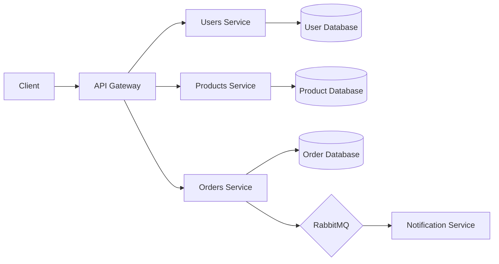

# .NET Microservices with Azure DevOps & AKS

<div align="center">
  
  
  
  
  
  
  A scalable eCommerce application built with microservices architecture using ASP.NET Core and Azure ecosystem
</div>

## 📋 Project Overview

This project demonstrates a cloud-native approach to building a scalable eCommerce platform using microservices. The application consists of several independently deployable services that work together to provide a complete shopping experience.

## 🛠️ Technical Stack

| Category | Technologies |
|----------|-------------|
| **Backend** | ASP.NET Core Web API |
| **Containerization** | Docker |
| **Orchestration** | Kubernetes, Azure Kubernetes Service (AKS) |
| **Databases** | Postgres, MySQL, MongoDB |
| **Message Broker** | RabbitMQ |
| **Caching** | Redis |
| **DevOps** | Azure DevOps, CI/CD pipelines |
| **Security** | Azure Key Vault, Microsoft Entra ID B2C |
| **API Management** | Ocelot API Gateway, Azure API Management |
| **Resilience** | Polly |

## 🏗️ Microservices Architecture

<div align="center">
  

</div>

The application is divided into the following microservices:

### 👤 Users Microservice
- Clean architecture implementation
- Uses AutoMapper and FluentValidation
- Manages user data and authentication

### 🛍️ Products Microservice
- Minimal API implementation
- MySQL database with EF Core
- Handles product catalog and inventory

### 📦 Orders Microservice
- MongoDB integration
- Minimal API approach
- Implements fault tolerance and resilience patterns

## 🚀 DevOps Integration

- CI/CD pipelines with Azure DevOps
- Environment management and configuration
- Zero downtime deployment strategies
- Secure configuration with Azure Key Vault

## ✅ Prerequisites

- Docker Desktop
- Basic knowledge of:
  - ASP.NET Core
  - C#
  - HTML, CSS, JavaScript
  - Angular (basic understanding to run the provided frontend)

## 🖥️ Frontend

The project includes a pre-built Angular frontend that integrates with the microservices backend.

## 🚦 Getting Started

1. Clone this repository
   ```bash
   git clone https://github.com/yourusername/dotnet-microservices-ecommerce.git
   ```
2. Install Docker Desktop
3. Navigate to the project directory
   ```bash
   cd dotnet-microservices-ecommerce
   ```
4. Run the application using Docker Compose
   ```bash
   docker-compose up -d
   ```
5. Or deploy to AKS using the provided scripts in the `/deploy` directory

## 📂 Project Structure

```
/
├── src/
│   ├── Services/
│   │   ├── Users/
│   │   ├── Products/
│   │   └── Orders/
│   ├── ApiGateways/
│   └── WebApp/
├── deploy/
│   ├── docker/
│   └── kubernetes/
└── docs/
```

## 🎓 Learning Outcomes

By exploring this project, you will gain practical experience with:

- Microservices architecture principles
- Container orchestration with Kubernetes
- Message-based communication between services
- Resilient application design
- Cloud-native development practices
- DevOps workflow and CI/CD implementation

## 📊 Performance Considerations

- Service-to-service communication optimized with gRPC
- Redis caching for frequently accessed data
- Horizontally scalable architecture
- Resource isolation through containerization

## 🛡️ Security Features

- Microsoft Entra ID B2C integration
- Token-based authentication
- Azure Key Vault for secrets management
- Network policies and service isolation

## 🤝 Contributing

Contributions are welcome! Please feel free to submit a Pull Request.

## 📝 License

This project is licensed under the MIT License - see the LICENSE file for details.